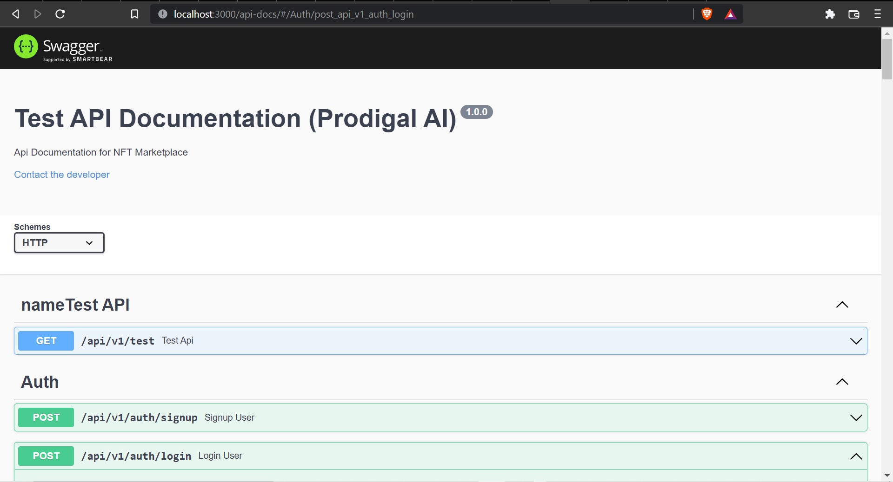

# Prodigal AI NFT MarketPlace App
This is the official backend for the NFT MarketPlace App. All the code is written using swagger documentation which will be present in <blockquote>/api-route</blockquote>

## Installation
```bash
git clone ---URL_PROVIDED
npm install --save-dev
npm start || npm run dev
```

npm start command triggers normal node server
npm run dev executes the nodemon command in the terminal

### Routes Present in the Server till Now
 - Login
 - Signup

### Swagger Documentation Screen Shot

 

<blockquote>Local Running Server : http://localhost:3000/api-docs</blockquote>
<blockquote>Production Running Server : http://localhost:3000/api-docs</blockquote>
